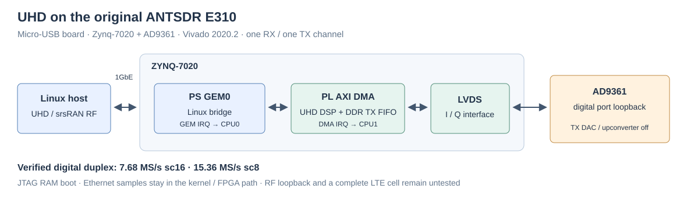
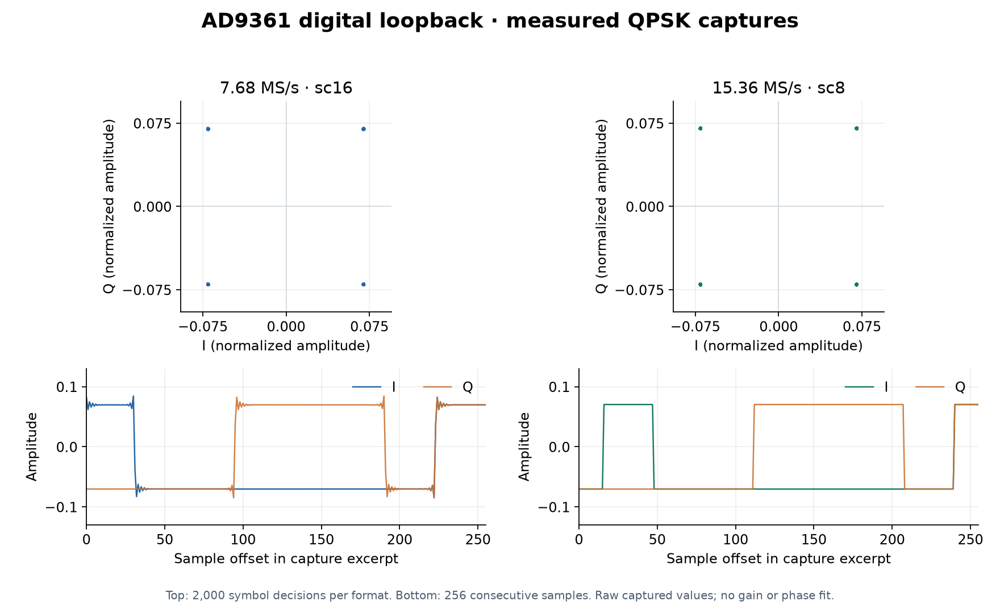

   

[English](#en) | [中文](#cn)

　

<span id="en">ANTSDR UHD with an Original E310 Micro-USB Port</span>
===========================

Fork of [MicroPhase/antsdr_uhd](https://github.com/MicroPhase/antsdr_uhd), the UHD host driver and FPGA/Linux firmware for ANTSDR E200 and E310V2, based on Ettus Research's UHD.

This fork adds **[antsdr_e310](./firmware/fpga/antsdr_e310/README.md)**: UHD on the **original Micro-USB ANTSDR E310 (Zynq-7020 + AD9361)**, using the board design from `antsdr_standalone` and Vivado 2020.2, booted over JTAG. Measured digital duplex: **7.68 MS/s with `sc16` and 15.36 MS/s with `sc8`, zero checked QPSK bit errors and no transport errors or timestamp gaps** in the runs below. The srsRAN 4G RF API also passes a 1.92 MS/s loopback through its UHD plugin.

　

|  |
| :------------------------------------------------: |
| **Figure1** : original E310 UHD data path and AD9361 digital loopback |

|  |
| :----------------------------------------------------------------: |
| **Figure2** : measured CODEC loopback captures: QPSK symbol decisions and I/Q waveforms, `sc16` at 7.68 MS/s and `sc8` at 15.36 MS/s ([plot and capture excerpts](./firmware/fpga/antsdr_e310/docs/img/)) |

　

## Original E310 Port (this fork)

* **PS Ethernet → Linux bridge → PL AXI DMA → UHD DSP → AD9361 LVDS**, with timestamps and the DDR TX FIFO. One receive and one transmit channel; samples stay in the kernel/FPGA path.
* **Board-specific LVDS timing and I/Q mapping**: RX half-word alignment, TX feedback clock and interface reset after AD9361 initialization. The E200/E310V2 profiles are retained.
* **Network tuning**: GEM interrupts on CPU0, DMA interrupts on CPU1; GEM RX/TX descriptor rings at 2048/1024 to absorb host bursts. Three 15.36 MS/s `sc16` TX-only benchmarks passed, five seconds each.

| Wire format | Duplex rate | Duration | Checked QPSK bits | Bit errors |
| :---------: | :---------: | :------: | ----------------: | ---------: |
| `sc16` | 1.92 MS/s | 1 s | 118,400 | 0 |
| `sc16` | 3.84 MS/s | 1 s | 238,400 | 0 |
| **`sc16`** | **7.68 MS/s** | **5 s** | **2,398,400** | **0** |
| **`sc8`** | **15.36 MS/s** | **3 s** | **2,878,400** | **0** |

All listed runs had zero RX/TX transport errors and timestamp gaps. QPSK uses 32 samples per symbol and one fixed alignment; the count is checked symbol bits, not every raw ADC bit. `sc8` halves the network payload by reducing the wire precision. These are short digital tests: 15.36 MS/s `sc16` duplex still overflows/underflows, and RF loopback and a complete LTE cell have not been tested.

Build, board constraints and bring-up: [firmware/fpga/antsdr_e310](./firmware/fpga/antsdr_e310/README.md) (Vivado / Vitis 2020.2). [srsRAN RF API test](./firmware/fpga/antsdr_e310/tests/srsran/README.md), [loopback results](./firmware/fpga/antsdr_e310/docs/2026-10-05-diagnostics.md), [network tuning and logs](./firmware/fpga/antsdr_e310/docs/network-tuning.md). The FPGA build is scripted; a complete SD-card image build remains to be integrated.

　

## Upstream ANTSDR E200 / E310V2

* Host driver and firmware: [host](./host/README.md), `firmware/fpga`, `firmware/linux`, `firmware/u-boot-xlnx` and `firmware/buildroot`.
* For **E200/E310V2**, use the [MicroPhase firmware release](https://github.com/MicroPhase/antsdr_uhd/releases/tag/v1.0), copy the extracted boot files to a FAT32 SD card and build the matching host UHD driver.
* The upstream images use `192.168.1.10` and require a 1000 Mbps Ethernet link. The original E310 port uses separate PS/PL addresses; its build and boot procedure is in the port directory above.
* [MicroPhase documentation](https://antsdr-doc-en.readthedocs.io/en/latest/index.html), [Ettus UHD](https://github.com/EttusResearch/uhd), [srsRAN 4G](https://github.com/srsran/srsRAN_4G).

　

## Citation

If this work helps your research, please cite it:

```bibtex
@misc{yu2026antsdr_e310_uhd,
    author = {Yijie Yu},
    title = {{ANTSDR UHD with an Original E310 Micro-USB Port}},
    year = {2026},
    howpublished = {\url{https://github.com/uceeyuf/antsdr_uhd}},
    note = {GitHub repository},
}
```

This is a fork: for the original driver and firmware, please also credit [MicroPhase/antsdr_uhd](https://github.com/MicroPhase/antsdr_uhd) and [Ettus Research UHD](https://github.com/EttusResearch/uhd).

GitHub also offers the citation under **Cite this repository** (from [CITATION.cff](CITATION.cff)).

　

## License

The repository includes [GNU GPL v3](LICENSE); individual files retain their license notices, including LGPL and the srsRAN test's AGPL notice. Upstream code: Ettus Research and MicroPhase. This fork's original-E310 port is maintained by Yijie Yu; upstream copyright and license notices are retained.

　

　

<span id="cn">ANTSDR UHD 与老款 E310 Micro-USB 移植</span>
===========================

Fork 自 [MicroPhase/antsdr_uhd](https://github.com/MicroPhase/antsdr_uhd)：基于 Ettus Research UHD，为 ANTSDR E200 和 E310V2 提供 UHD 主机驱动及 FPGA／Linux 固件。

本 fork 新增 **[antsdr_e310](./firmware/fpga/antsdr_e310/README.md#cn)**：结合 `antsdr_standalone` 的板级设计，在 **Micro-USB 老款 ANTSDR E310（Zynq-7020 + AD9361）** 上运行 UHD，使用 Vivado 2020.2、JTAG 启动。实测数字双向 **`sc16` 7.68 MS/s、`sc8` 15.36 MS/s**，下表测试均为 **QPSK 检查比特零误码，传输错误及时间戳断点为零**。srsRAN 4G RF API 经 UHD 插件的 1.92 MS/s 回环也已通过。

　

|  |
| :------------------------------------------------: |
| **图1** : 老 E310 UHD 数据通路与 AD9361 数字回环 |

|  |
| :-------------------------------------------------------------: |
| **图2** : CODEC 回环实测采样：QPSK 符号判决点与 I/Q 波形，`sc16` 7.68 MS/s 和 `sc8` 15.36 MS/s（[绘图脚本与采样片段](./firmware/fpga/antsdr_e310/docs/img/)） |

　

## 老 E310 移植（本 fork）

* **PS 以太网 → Linux bridge → PL AXI DMA → UHD DSP → AD9361 LVDS**，保留时间戳与 DDR TX FIFO；单接收单发射，样本经过内核／FPGA 数据通路。
* **板级 LVDS 时序与 I/Q 映射**：RX 半字对齐、TX 反馈时钟，以及 AD9361 初始化后的接口复位；保留 E200／E310V2 各自配置。
* **网络调优**：GEM 中断分配给 CPU0，DMA 分配给 CPU1；GEM RX/TX 描述符环设为 2048/1024，缓解主机突发流量。15.36 MS/s `sc16` 仅发基准测试通过三次，每次 5 秒。

| 传输格式 | 双向采样率 | 时长 | 检查的 QPSK 比特 | 比特错误 |
| :------: | :--------: | :--: | ---------------: | -------: |
| `sc16` | 1.92 MS/s | 1 秒 | 118,400 | 0 |
| `sc16` | 3.84 MS/s | 1 秒 | 238,400 | 0 |
| **`sc16`** | **7.68 MS/s** | **5 秒** | **2,398,400** | **0** |
| **`sc8`** | **15.36 MS/s** | **3 秒** | **2,878,400** | **0** |

以上各次 RX/TX 传输错误及时间戳断点均为零。QPSK 每符号 32 样本，只确定一次固定对齐；表中为检查的符号比特数，不是全部原始 ADC 比特。`sc8` 通过降低传输位宽将网络负载减半。这些是短时数字测试：15.36 MS/s `sc16` 双向仍有溢出／欠载，射频回环和完整 LTE 小区尚未测试。

编译、板级约束与启动见 [firmware/fpga/antsdr_e310](./firmware/fpga/antsdr_e310/README.md#cn)（Vivado / Vitis 2020.2）。另见 [srsRAN RF API 测试](./firmware/fpga/antsdr_e310/tests/srsran/README.md#cn)、[回环结果](./firmware/fpga/antsdr_e310/docs/2026-10-05-diagnostics.md#cn)、[网络调参与日志](./firmware/fpga/antsdr_e310/docs/network-tuning.md#cn)。FPGA 可通过脚本重建，完整 SD 卡镜像构建仍待集成。

　

## 原设计：ANTSDR E200／E310V2

* 主机驱动与固件：[host](./host/README.md)、`firmware/fpga`、`firmware/linux`、`firmware/u-boot-xlnx`、`firmware/buildroot`。
* **E200／E310V2** 使用 [MicroPhase 已发布固件](https://github.com/MicroPhase/antsdr_uhd/releases/tag/v1.0)，将解压后的启动文件复制到 FAT32 SD 卡，并构建配套 UHD 主机驱动。
* 上游镜像地址为 `192.168.1.10`，以太网需协商为 1000 Mbps。老 E310 移植使用独立的 PS／PL 地址，构建与启动方法见上面的移植目录。
* [MicroPhase 文档](https://antsdr-doc-en.readthedocs.io/en/latest/index.html)、[Ettus UHD](https://github.com/EttusResearch/uhd)、[srsRAN 4G](https://github.com/srsran/srsRAN_4G)。

　

## 引用

如果这个项目对你的研究有帮助，请引用：

```bibtex
@misc{yu2026antsdr_e310_uhd,
    author = {Yijie Yu},
    title = {{ANTSDR UHD with an Original E310 Micro-USB Port}},
    year = {2026},
    howpublished = {\url{https://github.com/uceeyuf/antsdr_uhd}},
    note = {GitHub repository},
}
```

这是一个 fork：原始驱动与固件请同时注明 [MicroPhase/antsdr_uhd](https://github.com/MicroPhase/antsdr_uhd) 和 [Ettus Research UHD](https://github.com/EttusResearch/uhd)。

GitHub 仓库页的 **Cite this repository** 也提供同样的引用（来自 [CITATION.cff](CITATION.cff)）。

　

## 许可证

仓库包含 [GNU GPL v3](LICENSE)；各文件保留自身许可证声明，包括 LGPL 和 srsRAN 测试的 AGPL 声明。上游代码来自 Ettus Research 和 MicroPhase，本 fork 的老 E310 移植由 Yijie Yu 维护，保留上游版权与许可声明。
